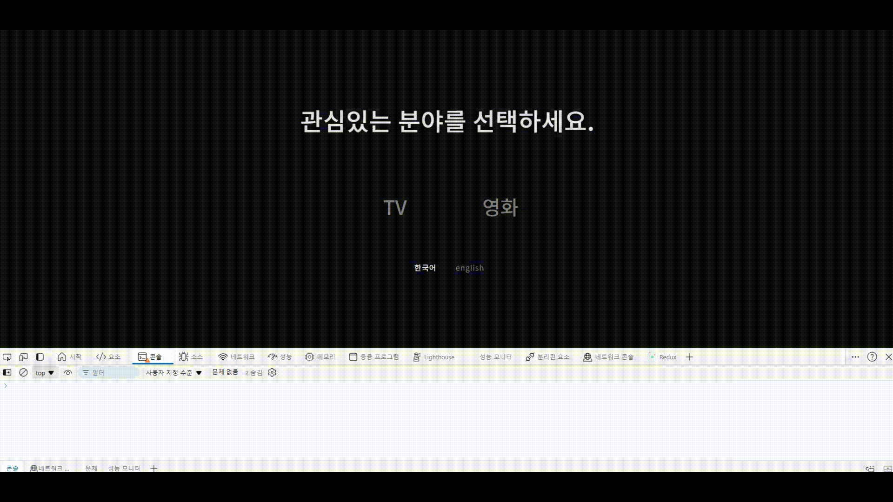

## TMDB-NETFLIX 첫번째 페이지

### 함수 구조

```
project
│
├── createGenre
│   ├── profileSelecteStates()
│   ├── tvGenres()
│   └── movieGenres()
│
└── mainSecForm
   └── changeTab
        ├── createSec12345 ...
        │
        └── transitionPage
            ├── fadeOutFistPage()
            └── fadeInSecondPage()
```

## createGenre

- ### API 재요청 : `tvGenres()`, `movieGenres()`

  사용자가 다른 설정을 적용했을 때 다른 데이터를 불러와야 했다. 특히 언어가 바뀔 때 고민이었다. 다시 데이터를 요청할지, 아님 데이터를 한번에 받아놓고 사용할지...

  결국 데이터를 한번에 받기로 결정했다. 지금 페이지를 들어가보면 처음 메뉴가 나타날 때 장르도 생성된다. 언어 데이터가 대용량 크기가 아니어서 계속 보관해도 웹 반응속도 저하에 문제 없었다. 덕분에 응답속도도 원활했다.

  

## mainSecForm

- ### 프로필 연속 클릭 : `changeTab`

  `HTML` 태그에 `data-`를 심고 `js`에서 데이터를 가져왔다. 사용자가 클릭한 프로필에 맞게 TV 또는 MOVIE로 페이지 전환을 하고 적용된 언어로 화면을 보여주는 함수다.

  화면이 전환될 때 다른 프로필을 선택하거나 연속으로 클릭하면 처음에 선택한 프로필이 아닌 다른 프로필로 보여지거나 데이터가 중복 생성돼서 오류를 발생하는 에러가 있었다.

  그 점은 `flag` 변수로 간단하게 해결됐다. 선택할 때는 `true` 선택되면 `false`로 설정해서 사용자의 일탈을 방지했다.

  상황에 맞춰 마우스 클릭 가능여부를 설정하고 프로필 박스에 호버를 주어 클릭 여부를 명확하게 했다.

  
